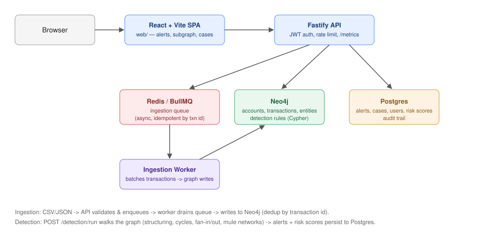

# FinTrace

A graph-based AML / transaction-monitoring engine. FinTrace ingests financial
transactions, models accounts and transfers as a graph, and runs detection
rules over that graph to surface suspicious patterns — structuring, circular
transfers, fan-in/fan-out fund concentration, and mule-account networks — for
analyst investigation.

## Why this matters

Money laundering rarely shows up in a single suspicious transaction — it shows
up in the *shape* of many transactions together: a dozen deposits just under a
reporting threshold, funds that loop back to where they started through a
chain of intermediaries, or a cluster of "unrelated" accounts that all share a
device fingerprint. Relational queries struggle with these patterns because
each one is fundamentally a graph-traversal question (variable-length paths,
shared-neighbor lookups) rather than a row filter. FinTrace exists to show
that structure directly: transactions are graph edges, not table rows, so a
rule like "does this account participate in a cycle of length 4-10" is a
handful of lines of Cypher instead of a recursive CTE or an application-level
BFS. That's also why the store split matters — Neo4j for the graph shape,
Postgres for the alerts/cases/audit trail that analysts actually work
against day to day — each store is doing the part it's good at.

## Status

Phase 5 (visualization UI) complete. See
[`docs/PLAN.md`](./docs/PLAN.md) for the full phased build plan and
[`docs/BENCHMARKS.md`](./docs/BENCHMARKS.md) for load-testing methodology and results.

## Stack

- **API**: Node.js + TypeScript + Fastify
- **Graph store**: Neo4j (Cypher) — native traversal for cycle/fan-in-fan-out detection
- **Relational store**: Postgres — case management, alerts, audit trail
- **Queue**: BullMQ (Redis) — async ingestion and scoring
- **Tests**: Vitest (+ Testcontainers for real Neo4j/Postgres in CI)

## Getting started

```bash
cp .env.example .env
docker compose up -d      # Neo4j, Postgres, Redis
npm install
npm run db:migrate          # apply Neo4j constraints/indexes
npm run db:migrate:postgres # apply Postgres schema (alerts, users, cases, risk scores)
npm run db:seed              # seed dev-only admin/analyst users
npm run dev                  # http://localhost:3000/health
npm run worker                # in a second terminal: consumes the ingestion queue

cd web && cp .env.example .env && npm install && npm run dev  # http://localhost:5173
```

## Scripts

- `npm run dev` — run the API with hot reload
- `npm run worker` — run the BullMQ ingestion worker (writes to Neo4j)
- `npm run db:migrate` — apply Neo4j constraints and indexes
- `npm run db:migrate:postgres` — apply Postgres schema migrations
- `npm run db:seed` — seed dev-only `admin`/`analyst` users (see credentials in `src/db/seedUsers.ts`)
- `npm run build` / `npm start` — compile and run production build
- `npm run lint` / `npm run typecheck` — static checks
- `npm test` — unit tests (no external services required)
- `npm run test:integration` — integration tests against a real Neo4j via Testcontainers (requires Docker)
- `npm run db:explain` — run `EXPLAIN`/`PROFILE` against each detection rule's real Cypher (requires a running Neo4j)
- `npm run generate:data -- [count] [path]` — generate a synthetic transaction CSV (with injected structuring/fan-out patterns) for load testing
- `npm run load-test -- [csvPath] [baseUrl]` — end-to-end ingestion throughput + alert-query-latency benchmark (requires the full stack running; see `docs/BENCHMARKS.md`)

## Ingestion API (Phase 1)

- `POST /accounts` — `{ id, entityId?, entityName?, deviceId?, ipAddress? }`, upserts an account (optionally linked to an owning entity and/or a device/IP fingerprint)
- `POST /transactions` — `{ id, fromAccountId, toAccountId, amount, currency, timestamp }`, validated and enqueued for async, idempotent write
- `POST /transactions/batch` — multipart CSV upload with the same columns as above; each row is validated and enqueued independently, with per-row errors reported in the response

Transactions are modeled as their own graph node so metadata can be attached
and queried directly: `(Account)-[:SENT]->(Transaction)-[:RECEIVED_BY]->(Account)`,
with accounts optionally owned by an `Entity` via `(Entity)-[:OWNS]->(Account)`,
and optionally fingerprinted via `(Account)-[:USED_DEVICE]->(Device)` /
`(Account)-[:USED_IP]->(IpAddress)`.

## Detection engine (Phase 2)

- `POST /detection/run` — runs all detection rules over the current graph and persists any hits as alerts; returns a per-rule summary
- `GET /alerts?rule=<name>&limit=&offset=` — lists persisted alerts, optionally filtered by rule name, paginated (`limit` 1-200, default 50)

Rules (`src/detection/rules/`), each a `DetectionRule` implementing a `run(session)` that returns scored `AlertCandidate`s:

- **structuring** — an account sending several sub-threshold transfers that sum above a reporting threshold within a lookback window
- **cycle** — funds routed through a chain of accounts and back to the originating account (round-tripping)
- **fan-in-fan-out** — one account concentrating funds from, or distributing funds to, many distinct counterparties within a window
- **mule-network** — multiple accounts sharing a device or IP fingerprint

Alerts are persisted to Postgres (`alerts` table: rule name, score, implicated account/transaction IDs, JSON details) so they're queryable independently of the graph.

## Auth (Phase 3)

Every route except `GET /health` and `POST /auth/login` requires a Bearer JWT.

- `POST /auth/login` — `{ username, password }` → `{ token }` (8h expiry). Seed dev users with `npm run db:seed`.
- Roles: `analyst` and `admin`. `admin` is a superset of `analyst`. Currently only `POST /detection/run` is admin-only; everything else just requires a valid token.

```bash
TOKEN=$(curl -s -X POST localhost:3000/auth/login -H 'content-type: application/json' \
  -d '{"username":"analyst","password":"analyst_dev_password"}' | jq -r .token)
curl -s localhost:3000/accounts/acct-a -H "Authorization: Bearer $TOKEN"
```

## Risk scoring, accounts/transactions detail, and subgraph (Phase 3)

- `GET /accounts/:id` — account detail, including owning entity if any
- `GET /accounts/:id/subgraph?depth=2` — the account's transaction neighborhood (up to `depth` hops, max 5) as `{ nodes, edges }`, ready for graph visualization
- `GET /accounts/:id/risk` — the account's current risk score and contributing rules
- `GET /accounts/risk?limit=20` — top accounts by risk score
- `GET /transactions/:id` — transaction detail

After each `POST /detection/run`, every flagged account gets a risk score in
`[0, 1]` via a noisy-OR combination of its alert scores, weighted per rule
(`src/services/riskScoring.ts`) — the score saturates gracefully as more or
stronger signals stack up, rather than growing unbounded. Scores are persisted
in the `risk_scores` table.

## Case management (Phase 3)

- `POST /cases` — `{ title, accountIds?, alertIds?, assignedTo? }`
- `GET /cases?status=open|in_review|closed&limit=&offset=` — paginated (`limit` 1-200, default 50)
- `GET /cases/:id` — case detail including notes
- `PATCH /cases/:id` — `{ status?, assignedTo? }`
- `POST /cases/:id/notes` — `{ body }`, authored by the authenticated user

This closes the analyst workflow end-to-end: ingest → `POST /detection/run` →
`GET /alerts` / `GET /accounts/:id/subgraph` to investigate → `POST /cases` to
open a case and annotate it.

## API docs

`GET /docs` serves an interactive Swagger UI over the full API surface (auth
excluded, since it's the one unauthenticated route); the raw spec is at
`GET /docs/json` (`src/docs/openapi.ts`).

## Performance & hardening (Phase 4)

- **Rate limiting** (`@fastify/rate-limit`): global default of `RATE_LIMIT_MAX` requests per `RATE_LIMIT_WINDOW_MS` per client (300/min by default); `POST /auth/login` has its own stricter limit (10/min) to slow down credential stuffing.
- **Metrics**: `GET /metrics` (Prometheus text format, no auth — scrapers don't carry a JWT) exposes default Node process metrics plus `http_request_duration_seconds` and `http_requests_total` histograms/counters labeled by method/route/status, recorded via an `onResponse` hook in `src/plugins/metrics.ts`.
- **Pagination**: `GET /alerts` and `GET /cases` accept `limit`/`offset` (`src/domain/schemas.ts#PaginationQuerySchema`, max `limit` 200).
- **Query optimization**: the `cycle` rule's variable-length traversal is the most expensive query in the engine (no index can bound "any account participating in a cycle shape"); `maxHops` is capped at 10 for this reason. A composite `Transaction(timestamp, amount)` index was added for future property-seek queries. `npm run db:explain` prints real `EXPLAIN`/`PROFILE` plans per rule so you can verify this against live data rather than guessing — see `docs/BENCHMARKS.md` for the full write-up.
- **Load testing**: `src/scripts/generateSyntheticData.ts` produces a synthetic transaction CSV (with injected structuring/fan-out patterns); `src/scripts/loadTest.ts` drives ingestion through the real API → queue → worker → Neo4j path and measures actual drain time (not just HTTP response time) for a true txns/sec figure, then benchmarks `GET /alerts` latency under concurrent load via `autocannon`. See `docs/BENCHMARKS.md` — the tooling is written and unit-tested, but hasn't been run end-to-end in this environment (no Docker available here); run it against `docker compose up` yourself and record results there.
- **Secrets hardening**: boot fails fast if `NODE_ENV=production` and `JWT_SECRET` is still the dev default (`src/config/env.ts`).
- **CORS**: `@fastify/cors` restricts cross-origin access to `WEB_ORIGIN` (default `http://localhost:5173`) so the browser can actually call the API from the `web/` app — needed once a real frontend showed up in Phase 5, caught by testing the login flow in a real browser rather than assuming it would work.

## Visualization UI (Phase 5)

A React + Vite SPA in `web/` that talks only to the Phase 3 API (no direct DB access). See `web/README.md`-equivalent below and `web/src/`.

- **Login** (`/login`) — JWT stored in `localStorage`; every other route is behind a `ProtectedRoute` that redirects here if unauthenticated.
- **Alerts** (`/alerts`) — paginated table, rule filter, a "Run detection" button that calls `POST /detection/run` inline, and a link from each alert straight into its account's subgraph or into opening a case.
- **Account subgraph** (`/accounts/:id/subgraph`) — the centerpiece: `GET /accounts/:id/subgraph` rendered with `@xyflow/react` (React Flow) for pan/zoom/minimap, laid out as concentric rings by BFS distance from the center account (computed client-side from the returned edges). Account and transaction nodes are styled distinctly, the center account is highlighted, clicking a node opens a detail panel, and a depth selector (1-5) re-queries the API. Verified live in a browser with a mocked API response — real usage needs the backend + Neo4j running with actual data.
- **Cases** (`/cases`, `/cases/new`, `/cases/:id`) — list/filter by status, create a case (pre-filled from an alert via router state), view notes, change status, add notes.
- **Risk** (`/risk`) — top accounts by risk score with their contributing rules, linking into the subgraph view.

```bash
cd web
npm run dev          # http://localhost:5173, proxies API calls to VITE_API_BASE_URL (default http://localhost:3000)
npm run build         # production build (tsc + vite build)
npm run lint / npm run typecheck
```

## Sample alert walkthrough

The fastest way to see the whole loop — ingest → detect → investigate → case
— without the UI:

```bash
# 1. generate a synthetic CSV with injected structuring/fan-out patterns
npm run generate:data -- 500 .data/demo.csv

TOKEN=$(curl -s -X POST localhost:3000/auth/login -H 'content-type: application/json' \
  -d '{"username":"admin","password":"admin_dev_password"}' | jq -r .token)

# 2. ingest it (validated + enqueued row-by-row; the worker drains it into Neo4j)
curl -s -X POST localhost:3000/transactions/batch \
  -H "Authorization: Bearer $TOKEN" -F file=@.data/demo.csv

# 3. run detection over the resulting graph
curl -s -X POST localhost:3000/detection/run -H "Authorization: Bearer $TOKEN" | jq

# 4. list what fired, e.g. structuring
curl -s "localhost:3000/alerts?rule=structuring&limit=5" -H "Authorization: Bearer $TOKEN" | jq

# 5. pull the implicated account's neighborhood — this is what the UI renders
#    as the pan/zoom graph at /accounts/:id/subgraph
curl -s "localhost:3000/accounts/<accountId>/subgraph?depth=2" -H "Authorization: Bearer $TOKEN" | jq

# 6. open a case against it
curl -s -X POST localhost:3000/cases -H "Authorization: Bearer $TOKEN" -H 'content-type: application/json' \
  -d '{"title":"Review structuring on <accountId>","accountIds":["<accountId>"]}' | jq
```

In the web UI (`cd web && npm run dev`), the same flow is: **Alerts** page →
"Run detection" → click an alert → **Account subgraph** view (pan/zoom, click
a node for detail) → "Open case" → **Cases** page to add investigation notes
and change status.

## Architecture



```
browser -> React/Vite SPA (web/) -> Fastify API -> Neo4j (graph: accounts, transactions, entities)
                                                  -> Postgres (alerts, cases, audit)
                                                  -> Redis/BullMQ (async ingestion + detection jobs)
```
